# CYNIC Architecture Diagrams

> **"φ distrusts φ"** - κυνικός
>
> Visual representations of CYNIC's architecture using Mermaid.

**Last Updated**: 2026-02-01

---

## 1. System Overview


---

## 2. 4-Layer Protocol Stack

```mermaid
flowchart TB
    subgraph L4["Layer 4: φ-BFT Consensus"]
        BFT[φ-BFT Voting]
        Threshold["61.8% Supermajority"]
    end

    subgraph L3["Layer 3: Gossip Propagation"]
        Gossip[Fibonacci Fanout]
        Fanout["13 peers/hop"]
    end

    subgraph L2["Layer 2: Merkle Knowledge Tree"]
        Merkle[Merkle Tree]
        Axioms["PHI / VERIFY / CULTURE / BURN"]
    end

    subgraph L1["Layer 1: Proof of Judgment"]
        PoJ[PoJ Chain]
        Blocks[Judgment Blocks]
    end

    L4 --> L3
    L3 --> L2
    L2 --> L1

    style L4 fill:#e94560,stroke:#1a1a2e
    style L3 fill:#f39c12,stroke:#1a1a2e
    style L2 fill:#27ae60,stroke:#1a1a2e
    style L1 fill:#3498db,stroke:#1a1a2e
```



---

## 3. The Eleven Dogs (Sefirot Tree)

```mermaid
flowchart TB
    subgraph Keter["Crown"]
        CYNIC["🧠 CYNIC<br/>Overseer"]
    end

    subgraph Supernal["Supernal Triad"]
        Binah["📊 Analyst<br/>Binah"]
        Daat["📚 Scholar<br/>Daat"]
        Chochmah["🦉 Sage<br/>Chochmah"]
    end

    subgraph Moral["Moral Triad"]
        Gevurah["🛡️ Guardian<br/>Gevurah"]
        Tiferet["🔮 Oracle<br/>Tiferet"]
        Chesed["🏗️ Architect<br/>Chesed"]
    end

    subgraph Action["Action Triad"]
        Hod["🚀 Deployer<br/>Hod"]
        Yesod["🧹 Janitor<br/>Yesod"]
        Netzach["🔍 Scout<br/>Netzach"]
    end

    subgraph Malkhut["Kingdom"]
        Carto["🗺️ Cartographer<br/>Malkhut"]
    end

    CYNIC --> Binah
    CYNIC --> Daat
    CYNIC --> Chochmah

    Binah --> Gevurah
    Daat --> Tiferet
    Chochmah --> Chesed

    Gevurah --> Hod
    Tiferet --> Yesod
    Chesed --> Netzach

    Hod --> Carto
    Yesod --> Carto
    Netzach --> Carto

    style CYNIC fill:#fff,stroke:#333,color:#000
    style Gevurah fill:#e74c3c,stroke:#c0392b
    style Binah fill:#3498db,stroke:#2980b9
    style Chesed fill:#3498db,stroke:#2980b9
    style Chochmah fill:#1abc9c,stroke:#16a085
    style Netzach fill:#27ae60,stroke:#1e8449
    style Tiferet fill:#f1c40f,stroke:#f39c12
    style Daat fill:#f1c40f,stroke:#f39c12
    style Hod fill:#f39c12,stroke:#e67e22
    style Yesod fill:#9b59b6,stroke:#8e44ad
    style Carto fill:#27ae60,stroke:#1e8449
```



---

## 4. Three Pillars

```mermaid
flowchart LR
    subgraph Left["Left Pillar<br/>JUDGMENT"]
        direction TB
        Guardian["🛡️ Guardian"]
        Analyst["📊 Analyst"]
        Deployer["🚀 Deployer"]
    end

    subgraph Middle["Middle Pillar<br/>BALANCE"]
        direction TB
        CYNIC["🧠 CYNIC"]
        Scholar["📚 Scholar"]
        Oracle["🔮 Oracle"]
        Janitor["🧹 Janitor"]
        Carto["🗺️ Cartographer"]
    end

    subgraph Right["Right Pillar<br/>CREATION"]
        direction TB
        Sage["🦉 Sage"]
        Architect["🏗️ Architect"]
        Scout["🔍 Scout"]
    end

    style Left fill:#e74c3c,stroke:#c0392b
    style Middle fill:#f1c40f,stroke:#f39c12
    style Right fill:#3498db,stroke:#2980b9
```



---

## 5. Judgment Flow


---

## 6. Q-Learning Router


---

## 7. Memory Tiers

```mermaid
flowchart TB
    subgraph Working["⚡ Working Memory"]
        W["7±2 items<br/>30 min TTL"]
    end

    subgraph Episodic["📝 Episodic Memory"]
        E["500 episodes<br/>7 day retention"]
    end

    subgraph Semantic["🧠 Semantic Memory"]
        S["5000 facts<br/>Persistent"]
    end

    subgraph Vector["🔢 Vector Memory"]
        V["10000 embeddings<br/>HNSW index"]
    end

    Working -->|"φ⁻¹ promotion"| Episodic
    Episodic -->|"φ⁻¹ promotion"| Semantic
    Semantic -->|"Embedding"| Vector

    Working <-->|"φ⁻² demotion"| Episodic

    style Working fill:#e74c3c,stroke:#c0392b
    style Episodic fill:#f39c12,stroke:#e67e22
    style Semantic fill:#27ae60,stroke:#1e8449
    style Vector fill:#3498db,stroke:#2980b9
```



---

## 8. Hook Event Flow


---

## 9. Deployment Architecture


---

## 10. Package Dependencies


---

## Usage

These diagrams use [Mermaid](https://mermaid.js.org/) syntax.

**View in GitHub**: GitHub renders Mermaid automatically.

**View locally**: Use a Mermaid-compatible viewer or VS Code extension.

**Export to PNG**:
```bash
npx @mermaid-js/mermaid-cli -i docs/DIAGRAMS.md -o docs/diagrams/
```

---

*"Loyal to truth, not to comfort"* - CYNIC
