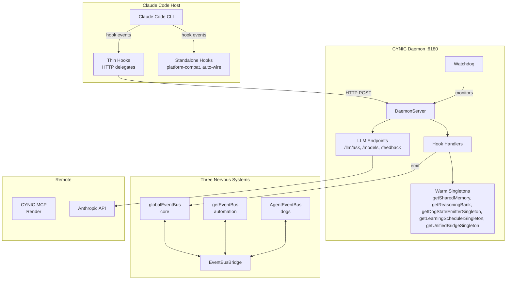
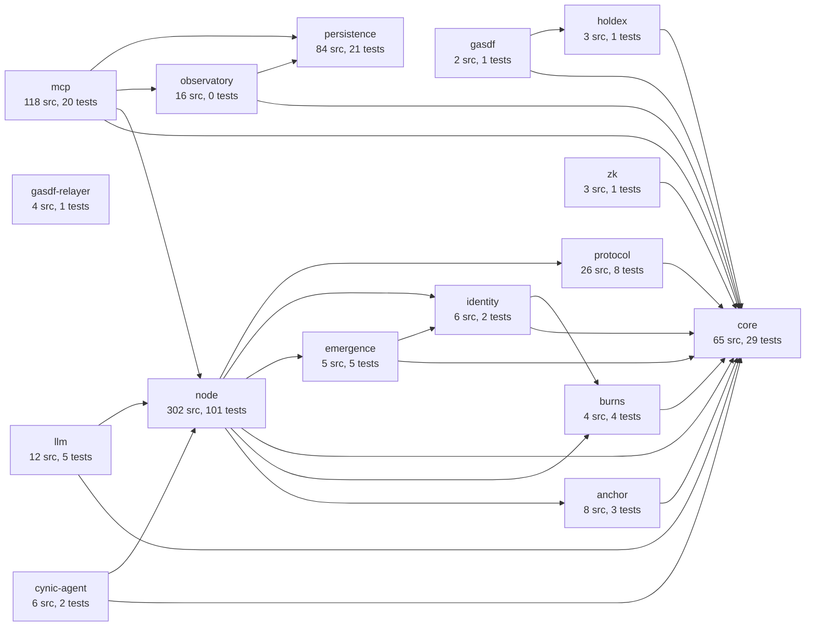
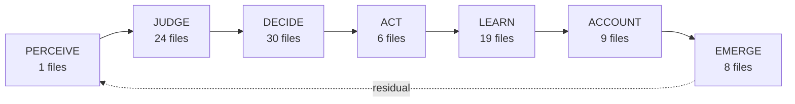

<!-- AUTO-GENERATED by scripts/tikkun/architecture-map.mjs -->
<!-- Generated: 2026-02-11T20:34:09.592Z -->
<!-- DO NOT EDIT MANUALLY -- run the generator to update -->

# CYNIC System Architecture Map

> Auto-generated from code reality. 664 source files scanned.
## System Topology

## Package Dependencies

## Hook Delegation

| Event | Type | Target |
|-------|------|--------|
| SessionStart | thin | `awaken.js` -> daemon |
| SessionEnd | thin | `sleep.js` -> daemon |
| UserPromptSubmit | thin | `perceive.js` -> daemon |
| PreToolUse | thin | `guard.js` -> daemon |
| PostToolUse | thin | `observe.js` -> daemon |
| Stop | thin | `stop.js` -> daemon |
| SubagentStart | thin | `spawn.js` -> daemon |
| SubagentStop | thin | `spawn.js` -> daemon |
| Error | thin | `error.js` -> daemon |
| Notification | thin | `notify.js` -> daemon |
| SessionStart | standalone | `platform-compat.js` |
| PostToolUse | standalone | `auto-wire.js` |

## The ONE Cycle

### Cycle Implementations

**PERCEIVE** (1):
- `symbiosis/human-perceiver.js` (symbiosis)

**JUDGE** (24):
- `solana/solana-judge.js` (solana)
- `social/social-judge.js` (social)
- `cosmos/cosmos-judge.js` (cosmos)
- `symbiosis/human-judge.js` (symbiosis)
- `judge/calibration-tracker.js` (cross)
- `judge/dimension-registry.js` (cross)
- `judge/dimensions.js` (cross)
- `judge/dpo-optimizer.js` (cross)
- `judge/dpo-processor.js` (cross)
- `judge/engine-integration.js` (cross)
- `judge/entropy.js` (cross)
- `judge/external-validation.js` (cross)
- `judge/feedback-processor.js` (cross)
- `judge/graph-integration.js` (cross)
- `judge/index.js` (cross)
- `judge/judge.js` (cross)
- `judge/judgment-card.js` (cross)
- `judge/rca-integration.js` (cross)
- `judge/residual-governance.js` (cross)
- `judge/residual.js` (cross)
- `judge/root-cause-analyzer.js` (cross)
- `judge/scorers.js` (cross)
- `judge/self-skeptic.js` (cross)
- `cycle/create-judge.js` (factory)

**DECIDE** (30):
- `code/code-decider.js` (code)
- `solana/solana-decider.js` (solana)
- `social/social-decider.js` (social)
- `cosmos/cosmos-decider.js` (cosmos)
- `cynic/cynic-decider.js` (cynic)
- `orchestration/brain.js` (cross)
- `orchestration/circuit-breaker.js` (cross)
- `orchestration/decision-event.js` (cross)
- `orchestration/decision-tracer.js` (cross)
- `orchestration/index.js` (cross)
- `orchestration/kabbalistic-router.js` (cross)
- `orchestration/llm-adapter.js` (cross)
- `orchestration/llm-orchestrator.js` (cross)
- `orchestration/mcp-instructions.js` (cross)
- `orchestration/planning-gate.js` (cross)
- `orchestration/routing-config.js` (cross)
- `orchestration/security-audit.js` (cross)
- `orchestration/skill-activator.js` (cross)
- `orchestration/skill-registry.js` (cross)
- `orchestration/unified-orchestrator.js` (cross)
- `routing/agent-booster.js` (cross)
- `routing/complexity-classifier.js` (cross)
- `routing/dog-capabilities.js` (cross)
- `routing/dog-performance.js` (cross)
- `routing/dog-pipeline.js` (cross)
- `routing/index.js` (cross)
- `routing/intelligent-router.js` (cross)
- `routing/strategy-manager.js` (cross)
- `routing/task-descriptor.js` (cross)
- `routing/tiered-router.js` (cross)

**ACT** (6):
- `code/code-actor.js` (code)
- `solana/solana-actor.js` (solana)
- `social/social-actor.js` (social)
- `cosmos/cosmos-actor.js` (cosmos)
- `cynic/cynic-actor.js` (cynic)
- `symbiosis/human-actor.js` (symbiosis)

**LEARN** (19):
- `code/code-learner.js` (code)
- `solana/solana-learner.js` (solana)
- `social/social-learner.js` (social)
- `cosmos/cosmos-learner.js` (cosmos)
- `symbiosis/human-learning.js` (symbiosis)
- `judge/learning-manager.js` (cross)
- `judge/learning-scheduler.js` (cross)
- `judge/learning-service.js` (cross)
- `orchestration/learning-service.js` (cross)
- `orchestration/q-learning-router.js` (cross)
- `learning/behavior-modifier.js` (cross)
- `learning/index.js` (cross)
- `learning/meta-cognition.js` (cross)
- `learning/model-intelligence.js` (cross)
- `learning/reasoning-bank.js` (cross)
- `learning/sona.js` (cross)
- `learning/thompson-sampler.js` (cross)
- `learning/unified-bridge.js` (cross)
- `learning/unified-signal.js` (cross)

**ACCOUNT** (9):
- `solana/solana-accountant.js` (solana)
- `symbiosis/human-accountant.js` (symbiosis)
- `accounting/code-accountant.js` (cross)
- `accounting/cosmos-accountant.js` (cross)
- `accounting/cost-ledger.js` (cross)
- `accounting/cynic-accountant.js` (cross)
- `accounting/index.js` (cross)
- `accounting/social-accountant.js` (cross)
- `routing/cost-optimizer.js` (cross)

**EMERGE** (8):
- `solana/solana-emergence.js` (solana)
- `symbiosis/human-emergence.js` (symbiosis)
- `emergence/code-emergence.js` (cross)
- `emergence/cosmos-emergence.js` (cross)
- `emergence/cynic-emergence.js` (cross)
- `emergence/index.js` (cross)
- `emergence/layer.js` (cross)
- `emergence/social-emergence.js` (cross)

## Event Wiring Health

| Metric | Count |
|--------|------:|
| Healthy (direct pub+sub) | 51 |
| Bridged (cross-bus via EventBusBridge) | 3 |
| **Connected (healthy + bridged)** | **54** |
| Orphan publishers | 21 |
| Orphan subscribers | 52 |
| Total unique events | 127 |
| Bridge rules | 11 |
| **Wiring health** | **43%** |

Orphan Publishers (no subscriber)

- `agent:viz:generated` (1x)
- `SUBAGENT_STARTED` (1x)
- `SUBAGENT_STOPPED` (1x)
- `ERROR_OCCURRED` (1x)
- `NOTIFICATION_RECEIVED` (1x)
- `model:recommendation` (1x)
- `daemon:health:degraded` (2x)
- `daemon:memory:pressure` (1x)
- `learning:cycle:complete` (1x)
- `node:started` (1x)
- `node:stopped` (1x)
- `velocity:alarm` (1x)
- `worker_pool:start` (1x)
- `worker_pool:stop` (1x)
- `worker_pool:task_queued` (1x)
- `worker_pool:task_cancelled` (1x)
- `worker_pool:task_started` (1x)
- `worker_pool:task_progress` (1x)
- `worker_pool:task_completed` (1x)
- `worker_pool:task_failed` (1x)
- `worker_pool:task_timeout` (1x)

Orphan Subscribers (no publisher)

- `agent:consensus:request` (6x)
- `agent:threat:blocked` (4x)
- `hook:session:start` (1x)
- `hook:session:stop` (1x)
- `hook:pattern:detected` (1x)
- `agent:consensus:response` (3x)
- `agent:profile:updated` (6x)
- `agent:knowledge:extracted` (3x)
- `agent:deploy:completed` (1x)
- `*` (1x)
- `agent:introspection:response` (1x)
- `agent:quality:report` (3x)
- `collective:vote:completed` (1x)
- `CIRCUIT_OPENED` (1x)
- `CIRCUIT_RECOVERED` (1x)
- `tool:completed` (5x)
- `block:proposed` (1x)
- `social:capture` (4x)
- `consciousness:changed` (3x)
- `session:started` (1x)
- `perception:fs:change` (1x)
- `perception:fs:add` (1x)
- `perception:fs:unlink` (1x)
- `perception:fs:addDir` (1x)
- `perception:fs:unlinkDir` (1x)
- `perception:fs:error` (1x)
- `perception:fs:ready` (1x)
- `human:judgment` (1x)
- `social:judgment` (2x)
- `social:decision` (1x)
- `social:action` (1x)
- `cynic:guidance` (1x)
- `cynic:override` (1x)
- `deploy:completed` (1x)
- `deploy:failed` (1x)
- `component:ready` (1x)
- `perception:solana:slot` (1x)
- `perception:solana:account` (1x)
- `perception:solana:connected` (1x)
- `perception:solana:disconnected` (1x)
- `perception:solana:error` (1x)
- `perception:solana:log` (1x)
- `perception:solana:program` (1x)
- `perception:solana:signature` (1x)
- `dog:vote:start` (1x)
- `dog:vote:cast` (1x)
- `dog:vote:complete` (1x)
- `consensus:forming` (1x)
- `consensus:reached` (1x)
- `conflict:detected` (1x)
- `conflict:resolved` (1x)
- `danger:blocked` (1x)

## 7x7 Matrix (verified file count)

| | PERCEIVE | JUDGE | DECIDE | ACT | LEARN | ACCOUNT | EMERGE | Total |
|---|---:|---:|---:|---:|---:|---:|---:|---:|
| **CODE** | - | - | 1f/465L | 1f/30L | 1f/331L | - | - | 3 |
| **SOLANA** | - | 1f/24L | 1f/492L | 1f/405L | 1f/479L | 1f/415L | 1f/569L | 6 |
| **MARKET** | - | - | - | - | - | - | - | 0 |
| **SOCIAL** | - | 1f/26L | 1f/24L | 1f/25L | 1f/24L | - | - | 4 |
| **HUMAN** | 1f/238L | 1f/24L | - | 1f/41L | 1f/515L | 1f/533L | 1f/605L | 6 |
| **CYNIC** | - | - | 1f/425L | 1f/478L | - | - | - | 2 |
| **COSMOS** | - | 1f/24L | 1f/24L | 1f/25L | 1f/24L | - | - | 4 |
| **CROSS** | - | 20f/10256L | 27f/15969L | 1f/211L | 14f/8416L | 7f/2901L | 6f/2260L | 75 |

## Daemon Endpoints

| Method | Path | Source |
|--------|------|--------|
| POST | `/hook/:event` | index.js |
| GET | `/health` | index.js |
| GET | `/status` | index.js |
| POST | `/llm/ask` | llm-endpoints.js |
| POST | `/llm/consensus` | llm-endpoints.js |
| GET | `/llm/models` | llm-endpoints.js |
| POST | `/llm/feedback` | llm-endpoints.js |
